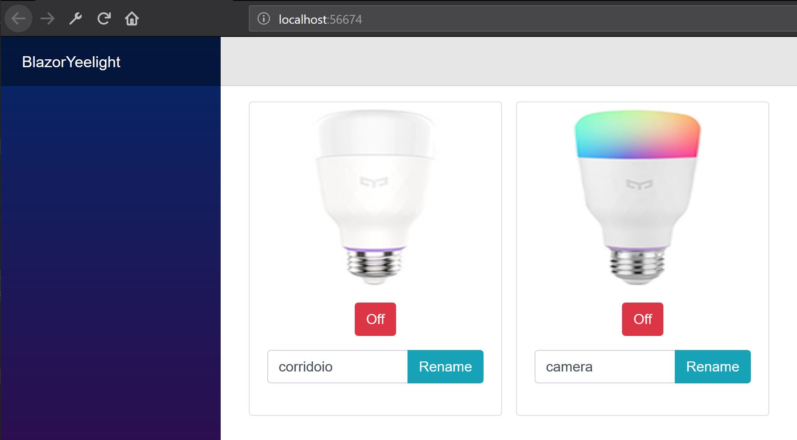

# BlazorYeelight

I created this sample project to see how simple is to use Blazor with server side rendering, to control your Yeelight's using an existing c# library.

The C# open source Yeelight library is https://github.com/roddone/YeelightAPI

